# NUS-Tree

A visual dependency graph system for NUS module planning.


## Foreword by developers

We decided to build NUS-Tree because we personally made some "mistakes" planning our modules. NUS-Tree aims to make it easier to plan for your courses and pick the most the interesting courses available to you even if you don't get your first choice.

NUS-Tree helps you visualise the full path to any course you may potentially want to take, showing the full series of courses you would need to take in a glance. In addition, we also have a post requisite tree, letting you see what courses you have just unlocked with your previous course. Our overall goal with NUS-Tree is to make module planning easier to help students take more exciting courses through their school tenure.

We personally realised we could only take some courses in year 4 now due to them dependencies and the some courses being semester 1 or semester 2 only. Seeing as this was a problem we faced, we thought it would be good to prevent others from facing the same issues in the future.
---

## Table of Contents

1. [Project Information](#project-information)
2. [Project Overview](#project-overview)
3. [Problem Statement](#problem-statement)
4. [Motivation](#motivation)
5. [Target Users](#target-users)
6. [User Stories](#user-stories)
7. [Feature Overview](#feature-overview)
8. [Detailed Feature Specification](#detailed-feature-specification)
9. [System Architecture](#system-architecture)
10. [Technical Design](#technical-design)
11. [Data Model](#data-model)
12. [Algorithms](#algorithms)
13. [Software Engineering Practices](#software-engineering-practices)
14. [Testing Plan](#testing-plan)
15. [CI/CD Plan](#cicd-plan)
16. [Weekly Development Timeline](#weekly-development-timeline)
17. [Milestone Scope](#milestone-scope)
18. [Risk Analysis](#risk-analysis)
19. [Project Log](#project-log)
20. [Setup Instructions](#setup-instructions)
21. [Testing Commands](#testing-commands)
22. [Deployment](#deployment)
23. [Future Work](#future-work)
24. [Team](#team)

---

## Project Information

| Field | Details |
|---|---|
| Project Name | NUS-Tree |
| Team Name | RAAR |
| Level of Achievement | Apollo 11 |
| Project Type | Visual module planning system |
| Primary Users | NUS students |
| Data Source | NUSMods API |
| Framework | Next.js |
| Visualisation Library | React Flow |
| Deployment Platform | Vercel |

---

## Project Overview

NUS-Tree is a visual supplement to NUSMods that helps NUS students understand module prerequisites, post-requisites, and long-term module planning paths.

The system is designed to support:

- Recursive prerequisite visualisation
- Reverse prerequisite or "post" requisite visualisation
- AND/OR prerequisite logic parsing (similar to NUSmods)
- Semester availability awareness
- NUSMods plan import and validation
- Automated testing and CI/CD workflows

---

## Problem Statement

Module planning is a complex multi-semester problem.

While NUSMods provides excellent scheduling and module information tools, students may still struggle with long-term planning because module relationships are difficult to visualise deeply.

Current pain points include:

1. Limited Prerequisite visibility

   Students can usually see direct prerequisites, but not the full recursive chain of prerequisites needed to reach a higher-level module.

2. No postrequisite visibility

   Students cannot easily answer: “What future modules will this module unlock?”

3. Hard to infer prerequisites with AND/OR logic

   Some modules have requirements involving AND/OR logic, such as:

   CS2040 and (CS2100 or EE2024) as a prerequisite. These requirements are difficult to understand when shown as plain text.

4. Semestral modules

   Some higher level modules are offered only in Semester 1 or Semester 2. Missing this detail can disrupt long-term plans.

5. Late Prerequisite discovery

   A student may only realise in Year 3 or Year 4 that they missed a key Year 1 or Year 2 prerequisite, potentially affecting graduation planning or potenitally causing the student to miss out on an interesting course.

---

## Motivation

NUS students often plan modules across several semesters, especially when aiming for advanced Level 3000 or Level 4000 modules.

For example, a CS freshman may want to take a Level 4000 module in Year 4. However, that module may require several intermediate modules, which themselves require earlier foundation modules. If the student does not identify these dependencies early, they may miss an important prerequisite and be blocked from taking their intended module later.

NUS-Tree aims to prevent this by making module dependencies visually explicit.

Instead of manually clicking through many module pages, students can use NUS-Tree to:

* See all prerequisite layers for a target module
* Understand which modules act as bottlenecks
* Discover what future modules are unlocked by a foundation module
* Identify missing prerequisites in their planned academic path

---

## Target Users

NUS-Tree is designed for:

1. **Freshmen planning long-term module paths**

   Students who want to plan from Year 1 to Year 4 and avoid missing early prerequisites.

2. **Students planning towards advanced modules**

   Students targeting Level 3000 or Level 4000 modules who need to understand the full dependency chain.

3. **Students choosing early modules**

   Students deciding whether a module is worth taking based on what future modules it unlocks.

4. **Students using NUSMods for semester planning**

   Students who already plan modules using NUSMods and want an additional validation layer.

5. **Students exploring alternatives**

   Students who cannot get a desired module and want to find alternative modules which they have unlocked.

---

## User Stories

### User Story 1: Long-Term Planning

As a Computer Science freshman, I want to see the full recursive prerequisite tree for a Level 4000 module, such as CS4226, so that I can plan the exact sequence of modules needed from Year 1 to Year 4.

### User Story 2: Unlocking Opportunities

As a student considering a foundation module, such as MA1521, I want to see a post-requisite tree showing every module that this module would eventually unlock.

### User Story 3: Prerequisite Validation

As a student using NUSMods, I want to import my planned schedule and see a visual warning if a module’s prerequisites are not met in preceding semesters.

### User Story 4: Alternative Pathfinding

As a student who failed to get into a specific module, I want to see a visual map of alternative modules that share the same prerequisite roots so that I can stay on track for my major.

---

## Feature Overview

| Feature                       | Category  | Milestone Target | Description                                       |
| ----------------------------- | --------- | ---------------- | ------------------------------------------------- |
| NUSMods API Integration       | Core      | MS2              | Fetch real module data from NUSMods               |
| Module Search and Detail View | Core      | MS2              | Search module codes and display module metadata   |
| Basic Dependency Graph        | Core      | MS2              | Render a one-level prerequisite graph             |
| Recursive Dependency Graph    | Core      | MS2              | Expand prerequisite graph recursively             |
| Unlocks View                  | Core      | MS2              | Show future modules unlocked by selected module   |
| Logic Parser                  | Extension | MS3              | Parse AND/OR prerequisite logic                   |
| NUSMods JSON Import           | Extension | MS3              | Import planned modules and validate prerequisites |
| Semester Availability Overlay | Extension | MS3              | Display Sem 1 / Sem 2 / both availability         |
| Path Recommendation Engine    | Extension | MS3+             | Suggest alternative module paths                  |

---

# Detailed Feature Specification

## Feature 1: NUSMods API Integration Layer

### Overview

The NUSMods API Integration Layer retrieves raw module data from the NUSMods API and transforms it into a consistent internal format used by the rest of the system.

This layer prevents the UI and graph logic from depending directly on external API response shapes.

### Responsibilities

The API layer will:

* Fetch module metadata from the NUSMods API
* Retrieve module code, title, description, prerequisites, and semester availability
* Normalize API responses into internal data structures
* Handle missing fields safely
* Handle invalid module codes
* Support caching to avoid unnecessary repeated requests (with possible storage of module results in a database later)

### Data Flow

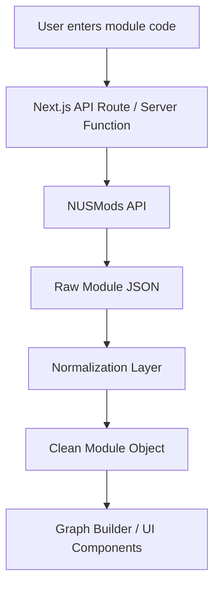

### Expected Input

```ts
type ModuleCodeInput = string;
```

Example:

```text
CS2040S
```

### Expected Output

```ts
type NormalizedModule = {
  moduleCode: string;
  title: string;
  description: string;
  prerequisite: string | null;
  semesterData: number[];
};
```

### Edge Cases / Type Errors

| Case                                 | Expected Behaviour                         |
| ------------------------------------ | ------------------------------------------ |
| Invalid module code                  | Display user-friendly error                |
| Missing prerequisite field           | Treat module as having no prerequisites    |
| API timeout                          | Show retry/error state                     |
| Inconsistent prerequisite formatting | Send text through preprocessing step       |
| Duplicate API calls                  | Use cache or memoization where appropriate |

### Milestone 2 Success Criteria

* User can enter a valid module code
* System fetches real module information
* System displays module code, title, description, and prerequisite text
* Invalid module codes do not crash the app

---

## Feature 2: Module Search and View

### Overview

The search interface is the main entry point of the application. Users search for a module code and receive structured module information before viewing the graph.

### Responsibilities

The search and detail view should:

* Accept module code input
* Standardise casing, for example `cs2040s` → `CS2040S`
* Trigger module data fetching
* Display loading, success, and error states
* Show selected module metadata clearly

### UI States

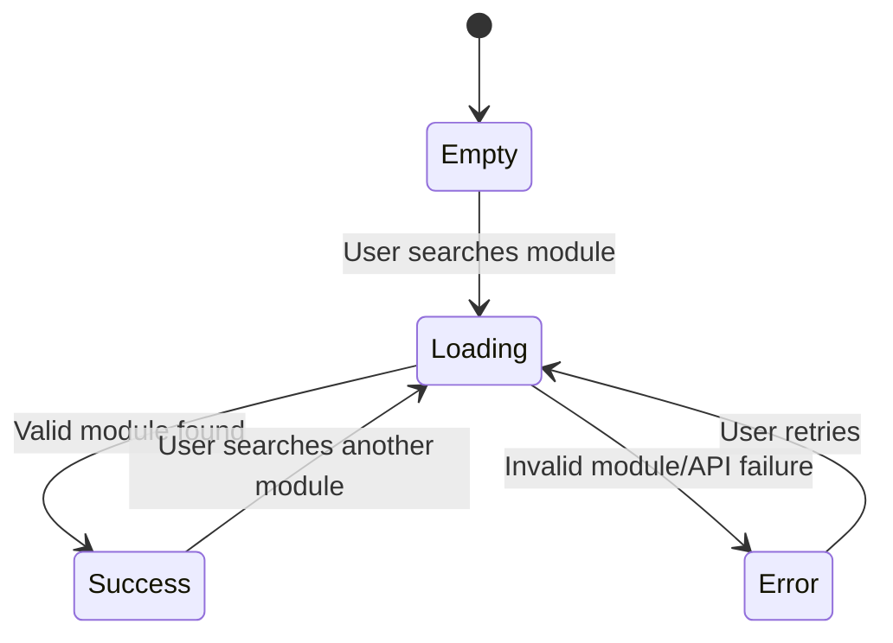

### Displayed Information

The module detail card should display:

* Module code
* Module title
* Module description
* Raw prerequisite string
* Semester of the module (or both sems if available)

### Milestone 1 Success Criteria

* Search input accepts a module code
* Search triggers data fetch
* Module details render correctly
* Loading state appears during fetch
* Error state appears for invalid input

---

## Feature 3: Recursive Dependency Graph Engine

### Overview

The Recursive Dependency Graph Engine is the core technical component of NUS-Tree. It converts prerequisite relationships into graph nodes and edges.

A selected target module becomes the root node. Its prerequisites become child nodes. Those child nodes may themselves have prerequisites, forming a multi-level dependency graph.

### Graph Model

NUS-Tree models modules as a directed graph:

```text
Prerequisite Module → Target Module
```

For example:

```text
CS1010 → CS2040 → CS3230
```

### Graph Diagram

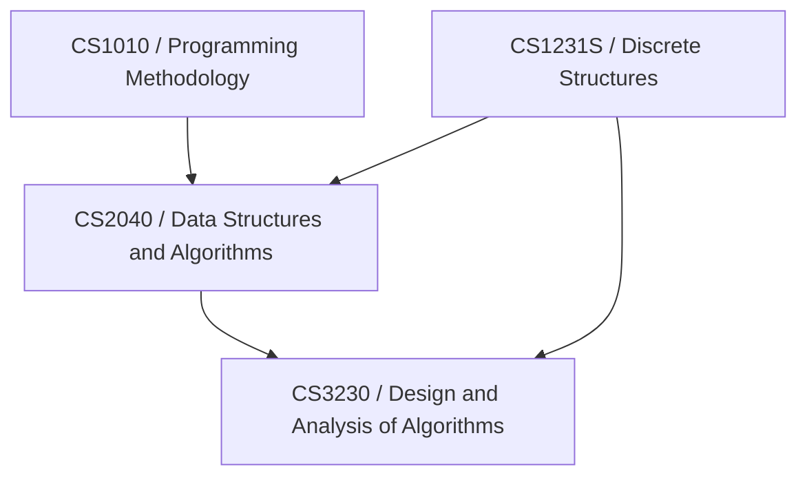

### Responsibilities

The graph engine should:

* Create graph nodes for each module
* Create directed edges for prerequisite relationships
* Expand prerequisite chains recursively
* Deduplicate repeated modules
* Prevent infinite recursion
* Support depth limits for performance
* Return graph data in a React Flow-compatible format

### Algorithm Sketch

```ts
function buildPrerequisiteGraph(moduleCode: string, visited = new Set()) {
  if (visited.has(moduleCode)) {
    return;
  }

  visited.add(moduleCode);

  const module = fetchModule(moduleCode);
  const prerequisites = parsePrerequisites(module.prerequisite);

  for (const prereq of prerequisites) {
    addNode(prereq);
    addEdge(prereq, moduleCode);
    buildPrerequisiteGraph(prereq, visited);
  }
}
```

### Graph Output Format

```ts
type GraphNode = {
  id: string;
  type?: string;
  data: {
    label: string;
    moduleCode: string;
    title?: string;
  };
  position: {
    x: number;
    y: number;
  };
};

type GraphEdge = {
  id: string;
  source: string;
  target: string;
};
```

### Milestone 1 Scope

For Milestone 1, the graph may support only one prerequisite level.

### Milestone 2 Scope

For Milestone 2, the graph should support full recursive traversal across multiple prerequisite levels.

### Success Criteria

| Requirement          | Criteria                                                      |
| -------------------- | ------------------------------------------------------------- |
| Node generation      | Every module in the dependency chain becomes exactly one node |
| Edge generation      | Every prerequisite relationship becomes a directed edge       |
| Deduplication        | Shared prerequisites do not appear multiple times             |
| Cycle protection     | Recursive traversal does not loop infinitely                  |
| Render compatibility | Output can be rendered by React Flow                          |

---

## Feature 4: Unlocks View / Reverse Dependency Engine

### Overview

The Unlocks View answers the reverse question:

> “If I take this module, what future modules does it unlock?”

This is useful for students deciding whether a foundation module is valuable for future academic paths.

### Concept

The normal prerequisite graph follows:

```text
Prerequisite → Module
```

The Unlocks View follows:

```text
Module → Future modules unlocked by this module
```


### Responsibilities

The Unlocks Engine should:

* Build a reverse adjacency list
* Find modules that depend on the selected module
* Traverse outward to find indirect unlocks
* Render unlock relationships as a graph
* Allow switching between Prerequisite View and Unlocks View

### Algorithm Sketch

```ts
function buildUnlockGraph(moduleCode: string) {
  const reverseMap = buildReverseDependencyMap(allModules);

  const queue = [moduleCode];
  const visited = new Set();

  while (queue.length > 0) {
    const current = queue.shift();

    for (const unlockedModule of reverseMap[current]) {
      if (!visited.has(unlockedModule)) {
        visited.add(unlockedModule);
        addEdge(current, unlockedModule);
        queue.push(unlockedModule);
      }
    }
  }
}
```

### Success Criteria

| Requirement      | Criteria                                              |
| ---------------- | ----------------------------------------------------- |
| Direct unlocks   | Shows modules that directly require selected module   |
| Indirect unlocks | Shows future modules unlocked through chains          |
| Reverse edges    | Edges point from selected module to unlocked modules  |
| View toggle      | User can switch between prerequisite and unlock views |
| Accuracy         | No unrelated modules appear in the unlock graph       |

---

## Feature 5: Prerequisite Logic Parser

### Overview

Some module prerequisites are not simple lists of modules. They may include logical conditions such as AND, OR, and nested requirements.

Example:

```text
CS2040 and (CS2100 or EE2024)
```

NUS-Tree should parse these strings into a structured representation so they can be visualised accurately.

### Supported Logic

| Type             | Example                         | Meaning                              |
| ---------------- | ------------------------------- | ------------------------------------ |
| Simple module    | `CS2040S`                        | One required module                  |
| AND condition    | `CS2040S and CS2100`             | Both modules required                |
| OR condition     | `CS2040S or CS2040S`             | Either module accepted               |
| Nested condition | `CS2040S and (CS2100 or EE2024)` | Required module plus one alternative |

### Parser Pipeline

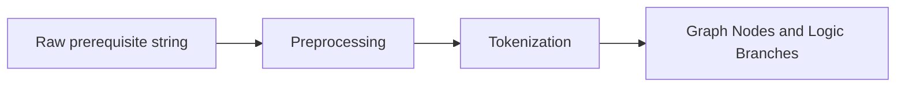

### AST Model

```ts
type PrerequisiteAST =
  | ModuleNode
  | AndNode
  | OrNode;

type ModuleNode = {
  type: "MODULE";
  moduleCode: string;
};

type AndNode = {
  type: "AND";
  children: PrerequisiteAST[];
};

type OrNode = {
  type: "OR";
  children: PrerequisiteAST[];
};
```

### Example AST

Input:

```text
CS2040 and (CS2100 or EE2024)
```

Output:

```json
{
  "type": "AND",
  "children": [
    {
      "type": "MODULE",
      "moduleCode": "CS2040"
    },
    {
      "type": "OR",
      "children": [
        {
          "type": "MODULE",
          "moduleCode": "CS2100"
        },
        {
          "type": "MODULE",
          "moduleCode": "EE2024"
        }
      ]
    }
  ]
}
```

### Success Criteria

| Requirement    | Criteria                                |
| -------------- | --------------------------------------- |
| Simple parsing | Single module string becomes ModuleNode |
| AND parsing    | AND expression becomes AndNode          |
| OR parsing     | OR expression becomes OrNode            |
| Nested parsing | Parentheses are preserved correctly     |
| Invalid format | System falls back to raw string display |
| Determinism    | Same input always produces same AST     |

---

## Feature 6: Graph Visualisation System

### Overview

The Graph Visualisation System renders dependency data using React Flow.

This layer is responsible for making the technical graph understandable and usable for students.

### Responsibilities

The graph UI should support:

* Node rendering
* Edge rendering
* Zooming
* Panning
* Node clicking
* Selected path highlighting
* View switching between prerequisites and unlocks
* Large graph readability improvements

### Rendering Flow

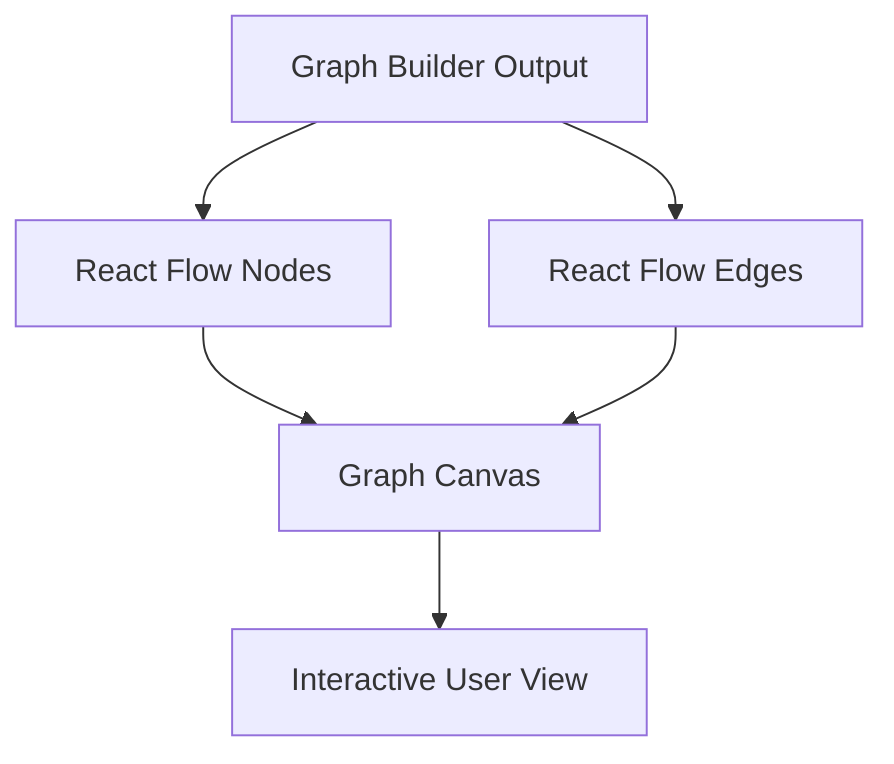

### Node Types

| Node Type         | Description                          |
| ----------------- | ------------------------------------ |
| Target node       | The module selected by the user      |
| Prerequisite node | A required module                    |
| Unlock node       | A module unlocked by selected module |
| Logic node        | AND/OR relationship node             |
| Warning node      | Missing or problematic requirement   |

### Success Criteria

| Requirement   | Criteria                                            |
| ------------- | --------------------------------------------------- |
| Graph renders | Nodes and edges appear correctly                    |
| Interaction   | User can zoom, pan, and click nodes                 |
| View update   | Graph updates when module changes                   |
| Readability   | Nodes are not excessively overlapping               |
| Stability     | Graph does not crash for empty prerequisite modules |

---

## Feature 7: Semester Availability Overlay

### Overview

Semester availability affects whether a student can actually follow a planned module path.

A module may be available in:

* Semester 1 only
* Semester 2 only
* Both semesters
* Unknown / not currently offered

### Data Model

```ts
type SemesterAvailability = {
  sem1: boolean;
  sem2: boolean;
};
```

### Visual Encoding

| Availability    | Visual Meaning               |
| --------------- | ---------------------------- |
| Semester 1 only | Sem 1 label / indicator      |
| Semester 2 only | Sem 2 label / indicator      |
| Both semesters  | Both labels                  |
| Unknown         | Warning or neutral indicator |

### Purpose

This feature helps students avoid plans that are logically valid but practically impossible due to semester sequencing.

### Success Criteria

| Requirement             | Criteria                                    |
| ----------------------- | ------------------------------------------- |
| Availability extraction | Semester data is extracted from module data |
| Node annotation         | Graph nodes display semester information    |
| Planning usefulness     | Students can identify semester-only modules |
| Graceful fallback       | Missing availability does not crash graph   |

---

## Feature 8: NUSMods JSON Import and Plan Validation

### Overview

This feature allows users to import their NUSMods plan and compare their planned modules against prerequisite requirements.

### Workflow

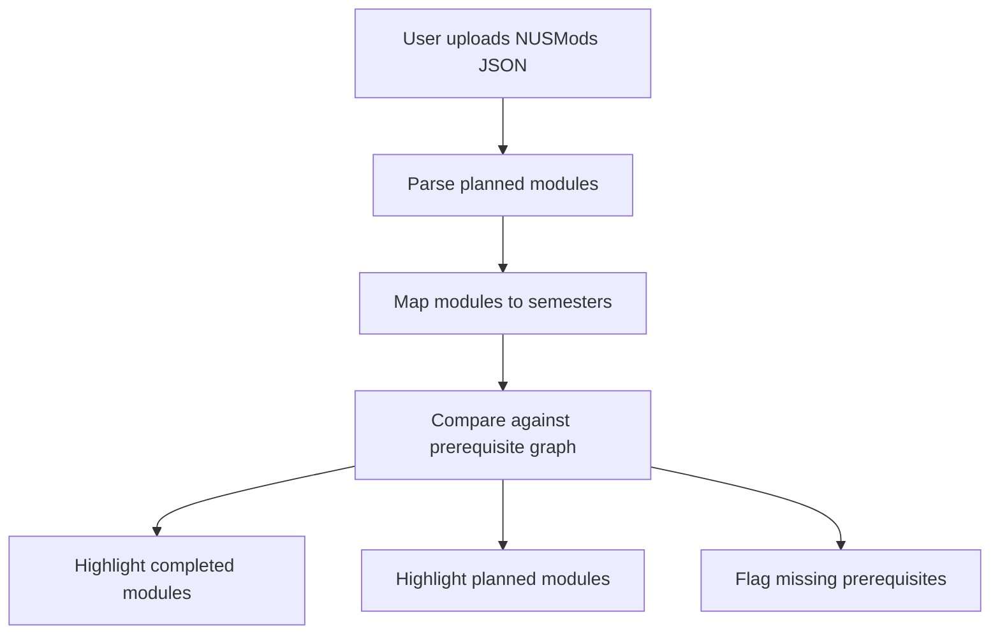

### Graph States

| State     | Meaning                                                |
| --------- | ------------------------------------------------------ |
| Completed | User has already completed the module                  |
| Planned   | User plans to take the module                          |
| Missing   | Required prerequisite not found before target semester |
| Target    | Module currently being inspected                       |

### Success Criteria

| Requirement       | Criteria                                      |
| ----------------- | --------------------------------------------- |
| JSON import       | Valid NUSMods plan can be uploaded            |
| Module extraction | Planned modules are extracted correctly       |
| Semester ordering | Module order is checked against prerequisites |
| Missing detection | Missing prerequisites are flagged             |
| Graph annotation  | Node status is visually reflected             |

---

## Feature 9: Path Recommendation Engine

### Overview

The Path Recommendation Engine helps students recover when a planned path is blocked.

For example, if a student wants to take CS3230 but has not taken CS2040S, the system can identify the missing prerequisite path.

### Responsibilities

The engine should:

* Detect bottleneck modules
* Identify missing prerequisites
* Suggest a shortest valid path to a target module
* Suggest alternative modules with similar prerequisite roots

### Example Output

```text
Target Module: CS3230

Missing prerequisite:
- CS2040S

Suggested path:
CS1010 → CS2040S → CS3230
```

### Success Criteria

| Requirement              | Criteria                                          |
| ------------------------ | ------------------------------------------------- |
| Missing module detection | System identifies unavailable target modules      |
| Shortest path            | System suggests minimal prerequisite path         |
| Alternative path         | System suggests comparable modules where possible |
| Explanation              | Recommendation is understandable to user          |

---

# System Architecture

## High-Level Architecture

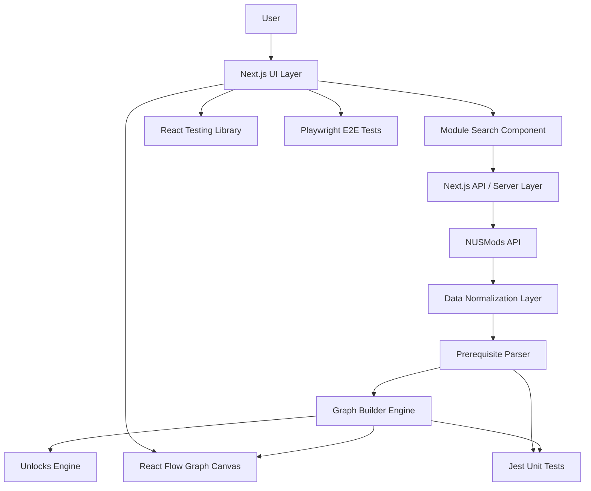

---

## Layered Architecture

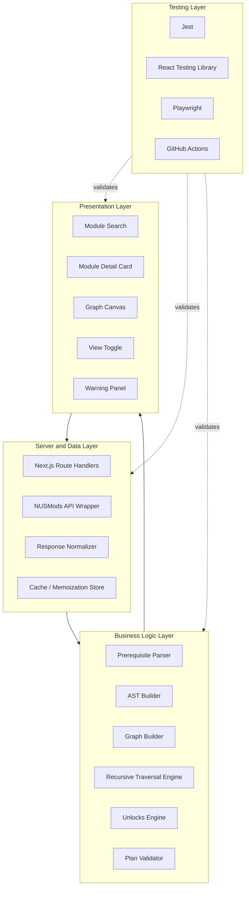

---

## Request Lifecycle

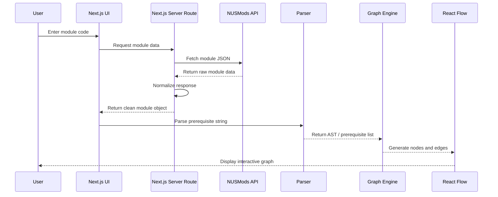

---

# Technical Design

## Full-Stack Framework Choice

NUS-Tree uses **Next.js as a full-stack framework**, using it for:

* Server-side API abstraction
* Route handlers
* Data preprocessing
* Future caching logic
* Deployment through Vercel

This design reduces the need for a separate backend during early development while still allowing clean separation between frontend, server logic, and business logic.

---

## Suggested Repository Structure

```text
nus-tree/
├── app/
│   ├── page.tsx
│   ├── layout.tsx
│   ├── globals.css
│   └── api/
│       └── modules/
│           └── route.ts
│
├── components/
│   ├── ModuleSearch.tsx
│   ├── ModuleCard.tsx
│   ├── GraphCanvas.tsx
│   ├── GraphNode.tsx
│   ├── ViewToggle.tsx
│   └── WarningPanel.tsx
│
├── lib/
│   ├── nusmods.ts
│   ├── normalizeModule.ts
│   ├── prereqParser.ts
│   ├── astBuilder.ts
│   ├── graphBuilder.ts
│   ├── unlocksBuilder.ts
│   ├── planValidator.ts
│   └── cache.ts
│
├── types/
│   ├── module.ts
│   ├── graph.ts
│   └── prereq.ts
│
├── tests/
│   ├── unit/
│   │   ├── prereqParser.test.ts
│   │   ├── graphBuilder.test.ts
│   │   ├── unlocksBuilder.test.ts
│   │   └── normalizeModule.test.ts
│   ├── components/
│   │   ├── ModuleSearch.test.tsx
│   │   ├── ModuleCard.test.tsx
│   │   └── GraphCanvas.test.tsx
│   └── e2e/
│       ├── module-search.spec.ts
│       ├── graph-render.spec.ts
│       └── json-import.spec.ts
│
├── public/
├── README.md
├── package.json
├── playwright.config.ts
├── jest.config.ts
└── next.config.js
```

---

# Data Model

## Module Data

```ts
type Module = {
  moduleCode: string;
  title: string;
  description: string;
  prerequisite: string | null;
  semesterData: SemesterAvailability;
};
```

## Prerequisite AST

```ts
type PrerequisiteAST =
  | ModuleNode
  | AndNode
  | OrNode;

type ModuleNode = {
  type: "MODULE";
  moduleCode: string;
};

type AndNode = {
  type: "AND";
  children: PrerequisiteAST[];
};

type OrNode = {
  type: "OR";
  children: PrerequisiteAST[];
};
```

## Graph Data

```ts
type GraphData = {
  nodes: GraphNode[];
  edges: GraphEdge[];
};

type GraphNode = {
  id: string;
  type: "target" | "prerequisite" | "unlock" | "logic" | "warning";
  data: {
    label: string;
    moduleCode?: string;
    title?: string;
    semesterData?: SemesterAvailability;
  };
};

type GraphEdge = {
  id: string;
  source: string;
  target: string;
  label?: string;
};
```

---

# Algorithms

## Recursive Prerequisite Traversal

Used to build the dependency graph from a target module.

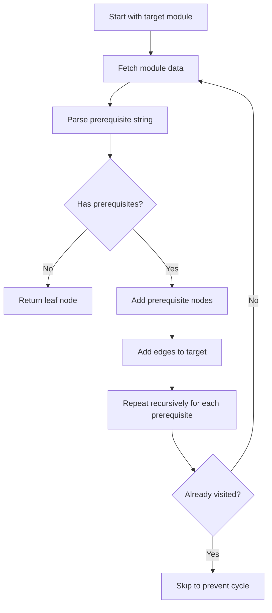

## Reverse Unlock Traversal

Used to build the Unlocks View.

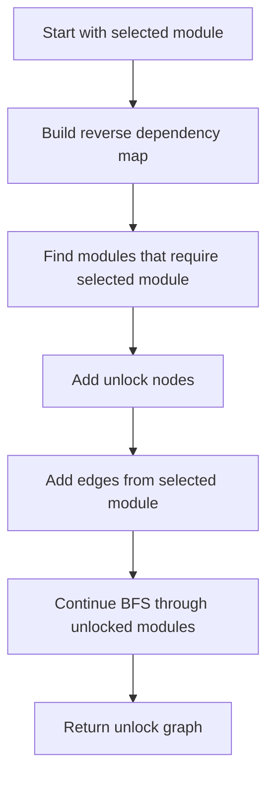

---

# Software Engineering Practices

## 1. Modular Architecture

NUS-Tree is divided into clear layers:

1. **Presentation Layer**

   Handles user interface, search, graph rendering, and interaction.

2. **Server/Data Layer**

   Handles NUSMods API requests, response normalization, and server-side abstractions.

3. **Business Logic Layer**

   Handles parsing, graph building, unlock traversal, and plan validation.

4. **Testing Layer**

   Validates the correctness of each layer through unit, component, and end-to-end tests.

This separation makes the system easier to maintain and test.

---

## 2. Separation of Concerns

Each module has a narrow responsibility, as such, we organise the files by reponsibility:


| File / Component     | Responsibility                                   |
| -------------------- | ------------------------------------------------ |
| `nusmods.ts`         | Fetch data from NUSMods API                      |
| `normalizeModule.ts` | Convert raw API response into internal format    |
| `prereqParser.ts`    | Parse prerequisite text                          |
| `graphBuilder.ts`    | Convert prerequisites into graph nodes and edges |
| `unlocksBuilder.ts`  | Build reverse dependency graph                   |
| `GraphCanvas.tsx`    | Render graph using React Flow                    |
| `ModuleSearch.tsx`   | Handle module search input                       |
| `planValidator.ts`   | Validate imported plans against prerequisites    |

---

## 3. Test-Driven Development for Parser Logic

The prerequisite parser is one of the highest-risk parts of the project because prerequisite strings may contain ambiguous natural language and logical conditions.

Therefore, we will use a test-first approach for parser development.

Before implementing a parser case, we will define expected outputs for examples such as:

```text
CS2040
CS2040 and CS2100
CS2040 or CS2040S
CS2040 and (CS2100 or EE2024)
```

---

## 4. Version Control Strategy

We use the following Github flow for version control:

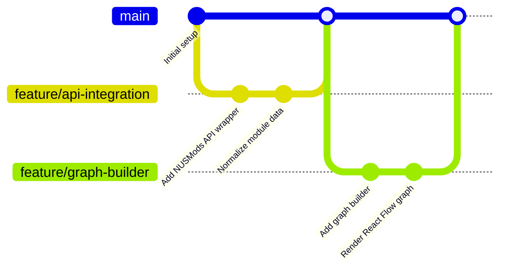

Branching rules:

* `main` branch is protected
* Features are developed on separate branches
* Pull requests are required before merging
* At least one peer review is required
* CI checks must pass before merging

---

# Testing Plan

NUS-Tree uses a three-layer testing strategy:

1. Unit testing with Jest
2. Component testing with React Testing Library
3. End-to-end testing with Playwright

---

## Testing Strategy Overview

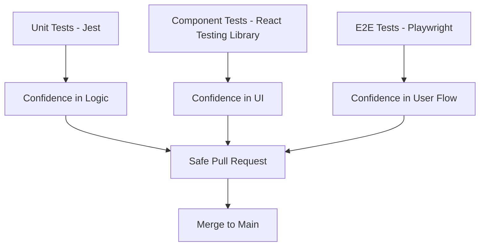

---

## Unit Testing: Jest

### Component 1: `normalizeModule.ts`

| Test Case             | Input                             | Expected Result          | Pass Criteria             |
| --------------------- | --------------------------------- | ------------------------ | ------------------------- |
| Valid module response | Raw NUSMods JSON                  | Normalized module object | All required fields exist |
| Missing prerequisite  | Module with no prerequisite field | `prerequisite: null`     | Still works               |
| Missing semester data | Incomplete semester data          | Empty or fallback value  | Still works               |
| Invalid structure     | Malformed object                  | Error or safe fallback   | Error handled gracefully  |

### Component 2: `prereqParser.ts`

| Test Case        | Input                           | Expected Result  | Pass Criteria               |
| ---------------- | ------------------------------- | ---------------- | --------------------------- |
| Simple module    | `CS2040`                        | ModuleNode       | AST matches expected output |
| AND condition    | `CS2040 and CS2100`             | AndNode          | Both children parsed        |
| OR condition     | `CS2040 or CS2040S`             | OrNode           | Alternatives parsed         |
| Nested condition | `CS2040 and (CS2100 or EE2024)` | Nested AST       | Parentheses preserved       |
| Invalid syntax   | Unknown text                    | Fallback display | No crash                    |

### Component 3: `graphBuilder.ts`

| Test Case              | Input                     | Expected Result        | Pass Criteria      |
| ---------------------- | ------------------------- | ---------------------- | ------------------ |
| Single prerequisite    | Module with one prereq    | Two nodes, one edge    | Correct direction  |
| Multiple prerequisites | Module with two prereqs   | Three nodes, two edges | All edges present  |
| Shared prerequisite    | Two branches share module | One node reused        | No duplicate nodes |
| Empty prerequisite     | Module with no prereq     | One node               | No orphan edges    |
| Recursive graph        | Multi-level chain         | Full chain rendered    | Correct depth      |

### Component 4: `unlocksBuilder.ts`

| Test Case       | Input                          | Expected Result           | Pass Criteria                |
| --------------- | ------------------------------ | ------------------------- | ---------------------------- |
| Direct unlock   | Module required by another     | One unlock edge           | Correct reverse direction    |
| Indirect unlock | Multi-level unlock chain       | Full unlock path          | BFS returns expected modules |
| No unlocks      | Module not required elsewhere  | Single node / empty graph | No false modules             |
| Duplicate paths | Multiple routes to same module | One module node           | Deduplication works          |

### Component 5: `planValidator.ts`

| Test Case            | Input                               | Expected Result   | Pass Criteria             |
| -------------------- | ----------------------------------- | ----------------- | ------------------------- |
| Valid plan           | All prerequisites completed earlier | No warnings       | Correct validation        |
| Missing prerequisite | Required module absent              | Warning generated | Missing module identified |
| Wrong order          | Prereq planned after target         | Warning generated | Semester order checked    |
| Completed module     | Module already completed            | Mark completed    | Correct status            |

---

## Component Testing: React Testing Library

### Component 1: `ModuleSearch`

| Behaviour           | Test Method        | Pass Criteria         |
| ------------------- | ------------------ | --------------------- |
| Renders input field | Render component   | Input visible         |
| Accepts module code | Simulate typing    | Input updates         |
| Submits search      | Simulate submit    | Callback triggered    |
| Normalizes casing   | Input `cs2040s`    | Search uses `CS2040S` |
| Handles empty input | Submit empty field | Error or no request   |

### Component 2: `ModuleCard`

| Behaviour               | Test Method              | Pass Criteria            |
| ----------------------- | ------------------------ | ------------------------ |
| Displays module code    | Render with mock data    | Code visible             |
| Displays title          | Render with mock data    | Title visible            |
| Displays description    | Render with mock data    | Description visible      |
| Handles no prerequisite | Render null prerequisite | Shows “No prerequisites” |
| Handles loading         | Render loading prop      | Loading state visible    |

### Component 3: `GraphCanvas`

| Behaviour     | Test Method            | Pass Criteria             |
| ------------- | ---------------------- | ------------------------- |
| Renders nodes | Pass mock nodes        | Nodes visible             |
| Renders edges | Pass mock edges        | Edges exist               |
| Empty graph   | Pass empty arrays      | Empty state visible       |
| Node click    | Simulate click         | Node detail callback runs |
| Graph update  | Rerender with new data | Old nodes replaced        |

### Component 4: `ViewToggle`

| Behaviour                 | Test Method    | Pass Criteria             |
| ------------------------- | -------------- | ------------------------- |
| Shows prerequisite mode   | Initial render | Correct label active      |
| Switches to unlock mode   | Click toggle   | Unlock mode active        |
| Calls handler             | Simulate click | Callback triggered        |
| Preserves selected module | Toggle view    | Selected module unchanged |

---

## End-to-End Testing: Playwright

### E2E Test 1: Valid Module Search

Steps:

1. Open the app
2. Enter `CS2040S`
3. Submit search
4. Wait for module data
5. Verify module details appear
6. Verify graph appears

Pass criteria:

* No page crash
* Module details visible
* Graph nodes visible
* Graph renders within acceptable time

### E2E Test 2: Invalid Module Code

Steps:

1. Open the app
2. Enter invalid module code
3. Submit search

Pass criteria:

* Error message shown
* App does not crash
* User can search again

### E2E Test 3: Prerequisite View to Unlocks View

Steps:

1. Search for a valid module
2. Wait for graph
3. Click Unlocks View toggle

Pass criteria:

* Unlock graph appears
* Graph changes from prerequisite mode
* No duplicate nodes appear

### E2E Test 4: NUSMods JSON Import

Steps:

1. Upload valid NUSMods JSON
2. Search for a module in the plan
3. Compare graph against planned modules

Pass criteria:

* JSON is parsed successfully
* Completed/planned modules are highlighted
* Missing prerequisites are flagged

---

## Performance Criteria

| Operation                 | Target                                       |
| ------------------------- | -------------------------------------------- |
| Module fetch              | Less than 1.5 seconds                        |
| One-level graph render    | Less than 2 seconds                          |
| Recursive graph expansion | Less than 3 seconds for typical module chain |
| View toggle               | Less than 300ms                              |
| JSON import validation    | Less than 3 seconds for typical plan         |

---

# CI/CD Plan

## CI/CD Overview

NUS-Tree uses GitHub Actions for CI and Vercel for deployment.

The goal of CI/CD is to ensure that all code merged into the main branch is:

* Linted
* Tested
* Buildable
* Reviewable
* Safe to deploy

---

## CI/CD Flow

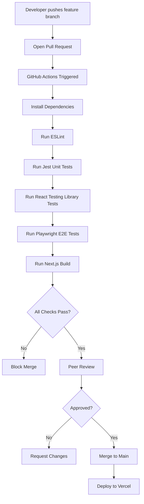

---

## Planned GitHub Actions Workflow

```yaml
name: CI

on:
  pull_request:
    branches:
      - main
  push:
    branches:
      - main

jobs:
  test-and-build:
    runs-on: ubuntu-latest

    steps:
      - name: Checkout repository
        uses: actions/checkout@v4

      - name: Setup Node.js
        uses: actions/setup-node@v4
        with:
          node-version: 20

      - name: Install dependencies
        run: npm ci

      - name: Run linting
        run: npm run lint

      - name: Run unit and component tests
        run: npm run test

      - name: Install Playwright browsers
        run: npx playwright install --with-deps

      - name: Run end-to-end tests
        run: npm run test:e2e

      - name: Build project
        run: npm run build
```

---


# Milestone Scope

## Milestone 1: Technical Proof of Concept

Expected scope:

* NUSMods API integration
* Module search
* Module information display
* Basic one-level prerequisite graph
* Initial README
* Initial testing plan
* Project log

## Milestone 2: Prototype

Expected scope:

* Recursive dependency graph
* Improved graph UI
* Unlocks View
* Expanded automated testing
* CI setup

## Milestone 3: Extended System

Expected scope:

* Logic parser
* NUSMods JSON import
* Semester availability overlay
* Path recommendation engine
* Full testing and deployment

---

# Risk Analysis

| Risk                                        | Impact | Mitigation                                                 |
| ------------------------------------------- | ------ | ---------------------------------------------------------- |
| Prerequisite strings are difficult to parse | High   | Start with simple parser, then expand to AST parser        |
| Graph becomes too large                     | Medium | Use collapsing, lazy loading, and memoization              |
| NUSMods API response changes                | Medium | Use normalization layer to isolate API changes             |
| Recursive traversal becomes slow            | Medium | Use caching and visited sets                               |
| Unlocks View requires scanning many modules | High   | Precompute reverse dependency map where possible           |
| JSON import format is inconsistent          | Medium | Validate schema and provide user-friendly errors           |
| Testing takes too long to set up            | Medium | Start with Jest, then add RTL and Playwright progressively |
| Team falls behind timeline                  | Medium | Track progress weekly and adjust scope early               |

--

# Setup Instructions

## Prerequisites

Install:

* Node.js 20+
* npm
* Git

## Clone Repository

```bash
git clone [TODO: GitHub repository link]
cd nus-tree
```

## Install Dependencies

```bash
npm install
```

## Run Development Server

```bash
npm run dev
```

Open:

```text
http://localhost:3000
```

---

# Testing Commands

## Run Linting

```bash
npm run lint
```

## Run Unit and Component Tests

```bash
npm run test
```

## Run End-to-End Tests

```bash
npm run test:e2e
```

## Run Production Build

```bash
npm run build
```